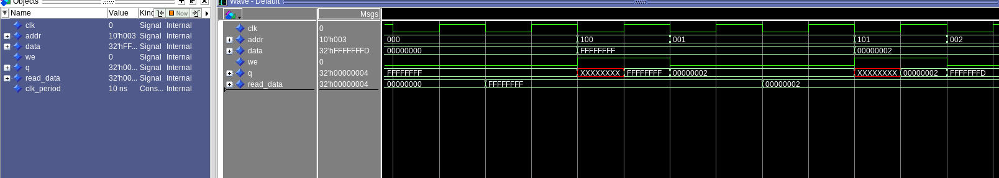

# vhdl_architecture_test

This repository contains VHDL implementations and simulation testbenches for core components of a simplified MIPS-like processor datapath. Built and tested using **QuestaSim**, this project demonstrates a modular understanding of computer architecture concepts and design validation using waveform simulation.

## 🧠 Project Overview

Each submodule in this repository was developed as part of a structured lab for learning and reinforcing key architectural components such as the register file, memory, ALU datapaths, bit-width extenders, and control logic. All components are testbench-verified with waveform outputs.

## 📂 Directory Structure

src/
├── extenders/ # Sign/zero extenders (16-bit to 32-bit)
├── memory/ # Word-addressable RAM with preloaded .hex data
├── myfirstdatapath/ # Datapath with ALU and Register File
├── myseconddatapath/ # Datapath with Memory access (lw, sw)
├── regfile/ # MIPS-style 32x32 register file (dual-read, single-write)
├── screenshots/ # Waveform screenshots from QuestaSim
├── lab2.pdf # Lab instructions
├── lab2.doc # Lab documentation notes

## ✅ Modules Implemented

- ✅ 32-register MIPS-style Register File with dual-read and single-write ports
- ✅ Structural decoder (5:32) and multiplexors (32:1, 2:1)
- ✅ Parameterized N-bit registers using flip-flops
- ✅ Sign and Zero Extenders (16-bit → 32-bit)
- ✅ Word-addressable RAM using `.hex` initialization
- ✅ Full datapath with control signals for add, sub, addi, lw, sw

## 📸 Sample Waveform

Below is a waveform screenshot showing successful simulation of datapath execution (e.g., `addi`, `add`, `sub` instructions):

## 🧪 Testing

All modules were simulated using QuestaSim with custom testbenches. The repo name `vhdl_architecture_test` reflects this emphasis on testing and verification.

---

